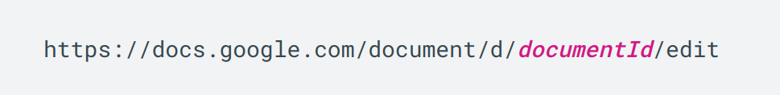
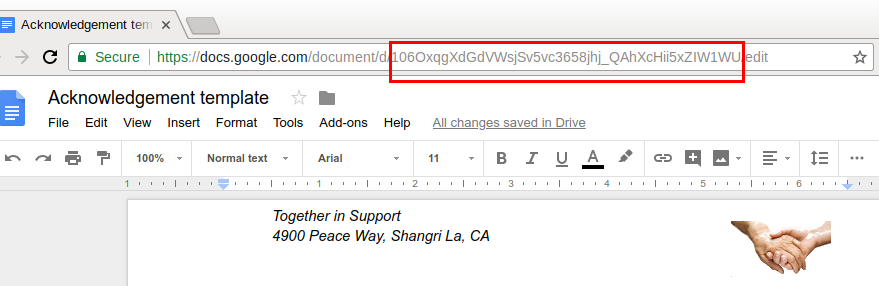
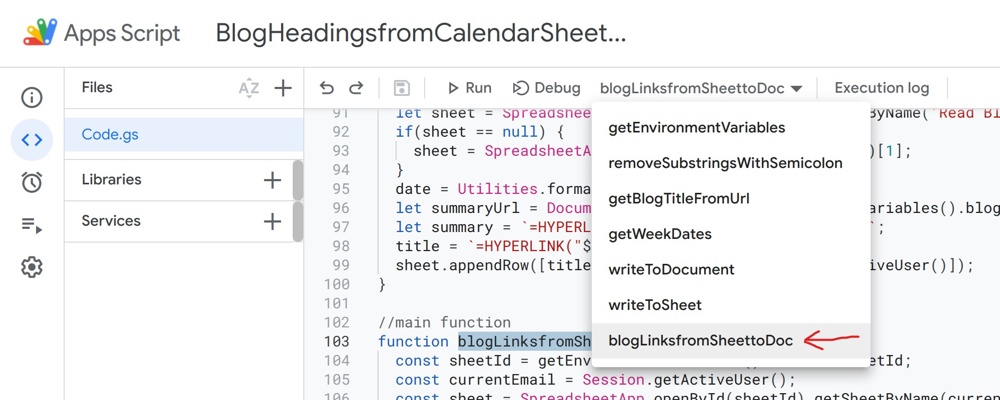

# Google Apps Script for Adding Blog Links
Google Apps Script for fetching blogs links from Calendar Sheet and appending blog title, summary, action item headings in Blog Summary Document and in Read Blogs Sheet.

## How to get [Id](https://developers.google.com/docs/api/how-tos/overview#document_id) of document or sheet
- The Id is a unique string containing letters, numbers, and some special characters. 
- Ids reference a document and they can be derived from the URL.

- Copy the Id from the google document or sheet url



# How to setup and use the script
- Create a project from Google Drivea
  - Open [Google Drive](https://drive.google.com/)
  - Create **New Folder** (suggested)
  - Click **New** > **More** > **Google Apps Script**
  - Add the code of the script
- Set Environment Variables
  - In line number 5, Copy and Paste your Blog Summary Document Id if blogSummaryDocId has empty string as value
    - ```javascript
        "blogSummaryDocId": "",
        ```
    - In line number 9, Copy and Paste your Team Calendar Sheet Id if calendarSheetId has empty string as value
    - ```javascript
        "calendarSheetId": "",
        ```
    - In line number 13, Copy and Paste your Read Blog Sheet Id if blogSummarySheetId has empty string as value
    - ```javascript
        "blogSummarySheetId": ""
        ```
- Select the function to run as 'blogLinksfromSheettoDoc'

- Save and run your app script

# Testing 
Before running the Google Apps Script for the actual Ids of the required sheets and document, please test the script first by adding sample sheets and documents which are copy of the main sheets and document.

### Steps for Testing:
1. Create new google **document** for blog summary
    - Copy and paste the document Id in the script
2. Create new google **sheet** for blog summary list
    - Rename the sheet as 'Read Blog'
    - Copy and paste the sheet Id in the script
3. Copy and paste your training team calendar sheet Id in script
4. Select the function named 'blogLinksfromSheettoDoc' for running in the script

- Please report if there are any errors.
